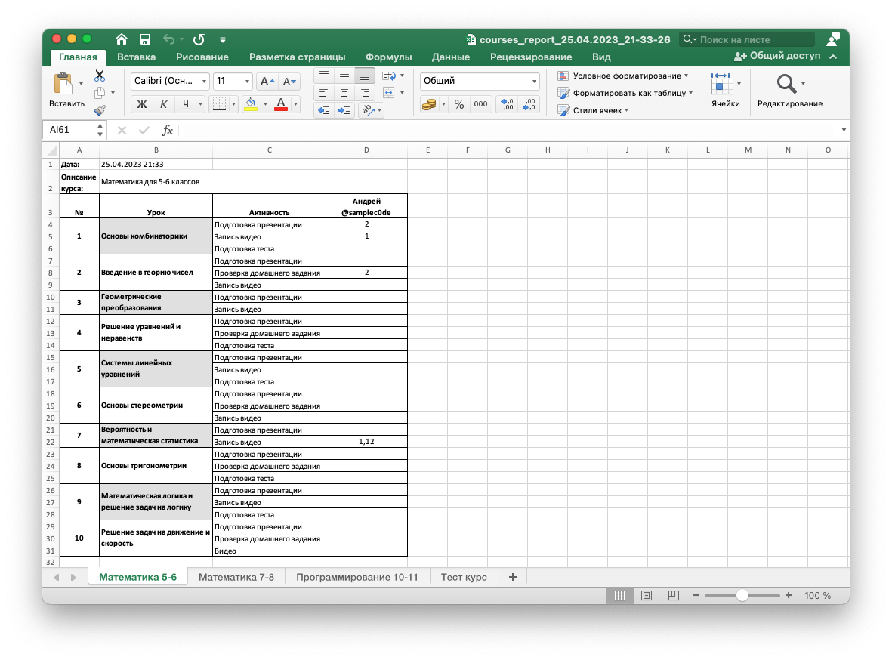

# Teacher Activity Tracker
## Описание проекта

Teacher Activity Tracker - это проект, созданный для автоматизированного опроса преподавателей о проделанной работе по курсам и урокам. Проект реализован на Python с использованием библиотеки Aiogram для работы с Telegram Bot API, а также Asyncpg для работы с PostgreSQL.

Основные функции бота включают:

- Регистрацию преподавателей и курсов
- Сбор информации об активностях преподавателей по урокам
- Создание сводных отчетов по активностям преподавателей в формате Excel
- Напоминания о предстоящем сборе информации об активностях перед окончанием срока

## Установка

1. Установите Docker и Docker Compose.
2. Клонируйте репозиторий:
```bash
git clone https://github.com/samplec0de/teacher-activity-tracker.git
cd teacher-activity-tracker
```
3. Заполните файл bot.env в корневой папке проекта
```
BOT_TOKEN=токен вашего бота от BotFather
ADMIN_PASSWORD=пароль администратора
```
4. Запустите проект с помощью Docker Compose:
```bash
docker-compose up -d
```

Бот будет запущен, и вы сможете начать взаимодействовать с ним через Telegram.

## Использование
1. Введите команду `/start` для начала работы с ботом.
2. Введите команду `/give_me_the_power` для получения прав менеджера.
3. Введите пароль из `ADMIN_PASSWORD` в файле `bot.env`.
3. Введите команду `/help` для получения справки по командам бота.
4. Создайте свой первый курс с помощью команды `/add_course`.
5. Добавьте уроки в курс с помощью команды `/add_lesson`.
6. Добавьте активности в урок с помощью команды `/add_activity`.
7. Создайте одноразовый код-ссылку подключения преподавателя к курсу в боте с помощью команды `/add_join_code`.

В дальнейшем вы сможете добавлять новые курсы, уроки и активности.
При необходимости вы можете изменить существующие курсы, уроки и активности или удалить их.

Для генерации отчета напишите `/generate_report` и следуйте инструкциям бота.

## Пример отчета
Отчет состоит из нескольких листов. На каждом листе отображается информация об одном курсе.
В первом столбце указывается номер урока, во втором название урока, в третьем название активности.
Следующие столбцы отображают количество часов, потраченных преподавателем на каждую активность в каждом уроке.



## Структура базы данных


## Структура пакетов


## Third-Party Dependencies:

- asyncpg: Copyright (c) 2016-present the asyncpg authors and contributors
- aiogram: Copyright (c) 2019 Alex Root Junior
- openpyxl: Copyright (c) 2010 openpyxl
- aiocron: Copyright (c) 2016 Gael Pasgrimaud
